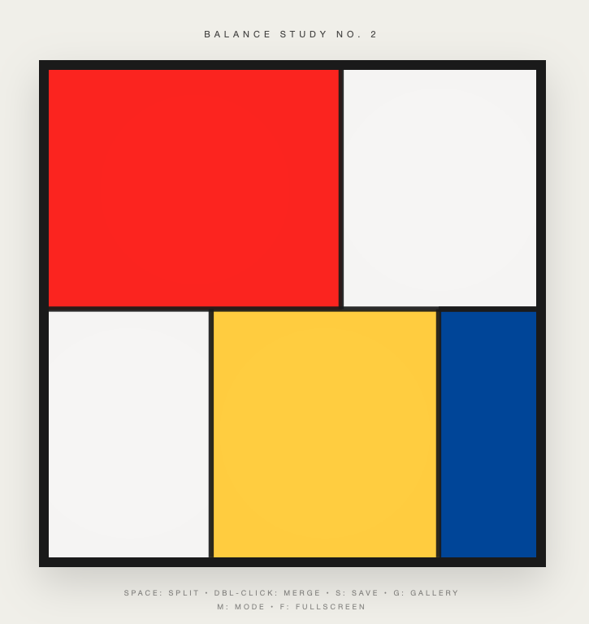

# Balance or Equilibrium Study No. 2

**An equilibrium game inspired by Mondrian**

Created for the [Gaming Like It's 1930](https://itch.io/jam/gaming-like-its-1930) game jam, celebrating works entering the public domain in 2026.

**[Play Online](https://seamuswaldron.github.io/balance/)** | Open `index.html` locally

---

## Overview

Balance is a minimalist strategy game about maintaining equilibrium in a dynamic abstract composition.

The board is not a puzzle to be solved, nor a system to be optimised. It is a structure under stress.

Over time, the composition drifts: colours accumulate weight, lines carry load, and harmony degrades. The player's role is not to build, but to intervene—carefully, sparingly, and with restraint.

There is no score, no timer, and no explicit objective beyond keeping the system alive.

## Core Idea

The game is built around a single principle:

> **Balance is not stability. Balance is continuous adjustment.**

Every action has consequences. Every solution introduces a future problem. Perfect order is as dangerous as chaos.

The player learns not by instruction, but by feel.

## How It Works

The composition behaves like a physical structure:

- **Colours have weight** — Red and blue press down; white floats
- **Size amplifies influence** — Large areas dominate
- **Position creates leverage** — Edge placement increases pressure
- **Lines carry tension** — They thicken under stress

The board drifts on its own. You respond. You are not racing the system—you are listening to it.

## Controls

| Action | Input |
|--------|-------|
| Move lines | Drag |
| Split largest rectangle | Space |
| Merge adjacent same-color rectangles | Double-click |
| Save composition | S |
| View gallery | G |
| Toggle mode | M |
| Fullscreen | F |

These actions are deliberately constrained. Mastery comes not from speed or precision, but from judgement.

## Modes

**Balance** — A meditation on visual weight. The canvas drifts gently, like a mobile turning in still air. There is no urgency, only the slow pull of gravity on pigment.

**Equilibrium** — A negotiation with entropy. The canvas resists your arrangements with gathering force. The question is not whether the system will fail, but how long you can hold it together.

## Design Philosophy

### Feedback Is Diegetic

The game never tells you how you are doing. Instead:

- Lines grow heavy under stress
- Colours fatigue or dominate
- Motion becomes resistant
- Calm feels light and responsive

If you feel uneasy, the system is uneasy.

### Merging and Splitting Are Philosophical Acts

- **Splitting** introduces flexibility but creates instability
- **Merging** restores calm but risks dominance

Neither action is inherently good. The game rewards those who understand *when* an action is appropriate—not those who rely on it.

### Failure Is Structural

You do not lose because of a single mistake. You lose when stress accumulates, corrections stop helping, and the system becomes rigid.

Failure is presented as inertia, not collapse. The board settles. The motion stops. The system can no longer change.

## What This Game Is Not

- It is not a sandbox
- It is not a score chase
- It is not a puzzle with a solution
- It is not a simulation of art-making

The player is not an artist. They are a caretaker.

## Inspiration

The game is inspired by the principles of Piet Mondrian and De Stijl—not their aesthetics alone:

- Asymmetrical balance
- Tension between order and freedom
- Reduction to essentials
- Harmony through restraint

*Composition with Red, Blue and Yellow* (1930) exemplifies Mondrian's Neo-Plasticism: primary colors, black lines, white space, and the pursuit of universal harmony through asymmetrical balance. The painting entered the public domain on January 1, 2026.

---

## Credits

Game by Seamus Waldron, 2026

Inspired by Piet Mondrian (1872–1944)
